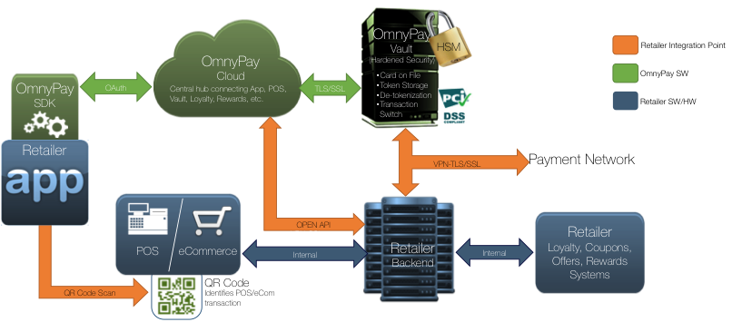
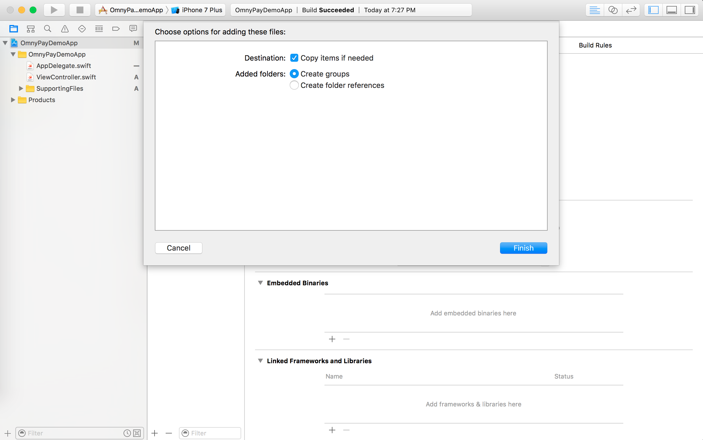
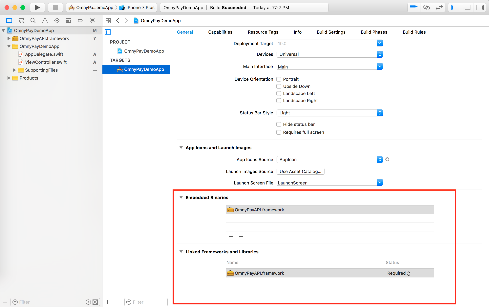
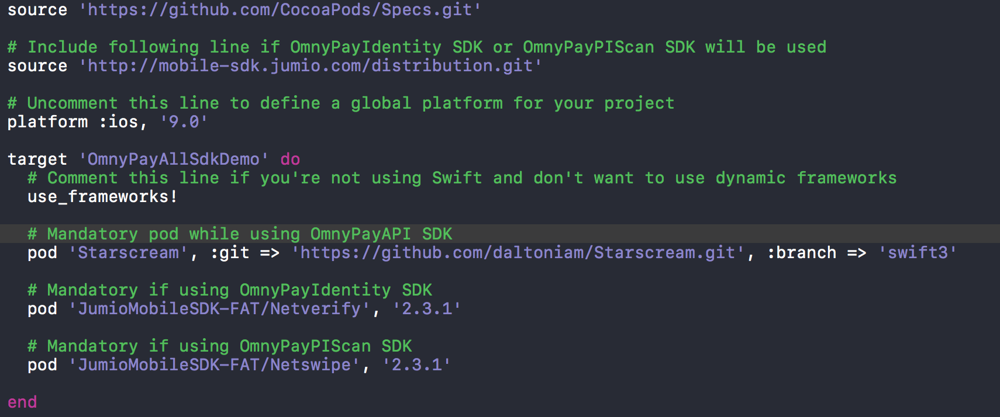

# [](http://www.omnypay.net/)

## Introduction
In order to serve the emerging needs of merchants, OmnyPay has developed a SaaS based white label Contextual Commerce platform with which merchants, banks and service providers will be able to offer their consumers, several unique digital commerce services, as part of their own branded mobile app – thus giving the merchants, full control of their consumer relationships, consumer data and consumer experiences when shopping across their multi-channels environments. Equally, working with partner’s bank’s app, merchants can have a “virtual” relationship with non-frequent customers as well.
The OmnyPay SaaS platform offers a cutting edge orchestration layer which allows the rapid integration of its platform to the merchants’ POS, CRM, Loyalty, marketing, inventory, analytics, and payments, while also enabling a unique core set of premium digital services as part of the Merchants’ own branded app for their repeat customers, and their partners app for less frequently visiting customers.



Consumers identify with the brands that they interact with the most, and have built inherent loyalty with them. The OmnyPay white label solution leverages and strengthens the ongoing brand equity built by the merchant or bank or service provider throughout the ongoing relationship with their loyal shoppers, and by consistently promoting it across all channels.  Through its mobile SDK and Open APIs, the OmnyPay platform can be quickly integrated with the existing mobile apps, as well as, with their legacy POS and backend systems.
## Registration

Register your app at http://www.omnypay.net. You will  be assigned a merchant id. Please save this for future.


## iOS SDK
OmnyPay provides various iOS SDKs in Swift that enables retailer/merchant iOS apps to integrate OmnyPay’s rich checkout experience for a shopper using the Retailer’s mobile app. OmnyPay SDK provides simple functions to perform operations on OmnyPay platform.


|   **SDK**   | **Description**                                                               | **Version** | **Release Date** |
|:-----------:|-------------------------------------------------------------------------------|:-----------:|:----------------:|
| OmnyPayAPI  | Provides access to OmnyPay Platform API                                       |     1.0     |    08-Dec-2016   |
| OmnyPayScan | Provides an easy way to scan machine readable codes like QRCode, Barcode etc. |     1.0     |    08-Dec-2016   |


### Requirements

- iOS 8.0+
- Xcode 8.0+
- Swift 2.3 or Objective C (Swift 3.0 support will be coming soon)


# Installation


## CocoaPods

[CocoaPods](http://cocoapods.org) is a dependency manager for Cocoa projects.

Currently Omnypay does not support CocoaPods but committed to provide it shortly. Please visit the site again on availability of CocoaPods. For those developers who have signed up for developer account already, an email notification about availability will be sent.

## Manual

Until we support CocoaPods installation, you can integrate OmnyPay into your project manually.

#### Embedded Framework
1. Download OmnyPay iOS SDKs <a href="https://github.com/omnypay/omnypay-sdk-ios">here</a>.
2. Navigate to the target configuration window and select the application target under the `Targets` heading in the sidebar.
3. In the tab bar at the top of that window, open the "General" panel.
4. Drag `OmnyPayAPI.framework` to "Embedded Binaries" section.
5. Choose "Copy items if needed" and "Create Groups". Click Finish.

    

6. Verify OmnyPayAPI.framework is added in "Linked Frameworks and Libraries" section also.

    

7. Create a `Podfile` in your project's root directory (where the xcodeproj file sits). For more information about `Podfile` see [CocoaPods](http://cocoapods.org).
8. Add below in your `Podfile`

    ```ruby
    platform :ios, '8.0'

    target 'OmnyPayDemoApp' do

      use_frameworks!

      pod 'Starscream', '~> 1.1.4'


    post_install do |installer|
      installer.pods_project.targets.each do |target|
        target.build_configurations.each do |config|
          config.build_settings['SWIFT_VERSION'] = '2.3' # or '3.0'
        end
      end
    end

    end
    ```

    

9.  Open terminal and run `pod install` in your project's root directory.
10. If you are including OmnyPayScan SDK then **follow Step 1-6 for OmnyPayScan.framework**.
11. That's it. Open the workspace and build.

## Integrating with core services

There are two main classes of OmnyPayAPI SDK:

- **OmnyPayAPI**: A static class that is used to access all OmnyPay APIs.
- **OmnyPayEventListener**: A singleton class to start listening to OmnyPay events like basket updated, receipt received etc. This class expects a delegate of type `OmnyPayEventDelegate` protocol to be set. All the callbacks are delivered to this delegate.

> **Note: All OmnyPay API returns the response in associated completion blocks. These blocks are always executed on application main queue, so you can freely perform any UI task.**

### Minimum steps required

All the APIs provided by the SDK perform specific operations as described in the [OmnyPay Platform REST API Overview](https://github.com/omnypay/omnypay-platform-api/wiki/OmnyPay-Platform-REST-API). 

However there are two minimum required steps to follow before any other operation can be performed, these are:

#### 1. Initialize SDK

Initialize the OmnyPay SDK using ```initialize(withMerchantId:configuration:completion:)``` api by passing your merchant Id. The merchant_id uniquely identifies your organization and any API calls to access or update resources are scoped within the merchant id.This should be called prior to calling OmnyPay functions and recommend this be invoked at application startup. The application can detect success through the completion handler.

#### 2. Authenticate shopper

OmnyPay supports authentication through a retailer authentication service. If a retailer authentication service is used, the Retailer should work with OmnyPay technical representative to establish connection before invoking the authentication API. OmnyPay supports [basic authentication] and oAuth token in its API and SDK

To verify using oAuth, the application should pass auth token and shopper id in ```authenticateShopper(shopperId:authToken:completion:)``` api. If the oAuth token is refreshed, the application should call this API to re-authenticate the user in order to allow the shopper to continue seamlessly. These steps are necessary to make minimum validations in order to continue with any further operation.


## Anatomy of a typical transaction flow

All the APIs perform specific operations so you can design your own transaction flow and user experience.

An example flow can be created as below:

- **Initialize the SDK**

    ```swift
    import OmnyPayAPI
    
    func application(application: UIApplication, didFinishLaunchingWithOptions launchOptions: [NSObject: AnyObject]?) -> Bool {
    // .....
    
    // Call Initialize with merchantId received as a part of registration process
    OmnyPayAPI.initialize(withMerchantId: <your mercahntId>, configuration: <[String : Any?]>) {
        (result,error) in
       
        guard error != nil else {
          print("Initialization failed.")
          return
        }
        
        /// Initialization successful.
    }
    ```
    
- **Authenticate your user with any identity service**
  
    Authenticate the user with your identity service (which can also be catered by OmnyPay). Once authenticated, pass on the Authorization token to the OmnyPay service.

- **Authenticate user (shopper) on OmnyPay platform by passing your user/shopper id and auth token**

    ```swift
    OmnyPayAPI.authenticateShopper(shopperId: "Your Shopper ID", authToken: "Your auth token") {
      (session, error) in
      
      guard error != nil else {
        print("Shopper not authenticated. Please check if auth token and shopper id is correct.")
        return
      }

      print("Shopper is successfully authenticated with OmnyPay.")
    }
    ```

- **Add a payment instrument for shopper**

    Depending on the vault configuration requested during merchant onboarding, OmnyPay SDK will connect to its own vault or a third party vault including that of a retailer.

    ```swift
    let provisionCardParam = ProvisionCardParam()
    provisionCardParam.cardNumber = "1234567812345678"
    provisionCardParam.cardAlias("mycard");
    provisionCardParam.cardType = CardType.Debit
    provisionCardParam.cardIssuer = "Thomas cook"
    provisionCardParam.cardHolderZip = "90211"
    provisionCardParam.cardExpiryDate = "12/2020"
    provisionCardParam.cardHolderName = "Jane Wilson"

    OmnyPayAPI.provision(paymentInstrument: provisionCardParam) {
      (paymentInstrumentInfo, error) in
      guard error != nil else {
        print("Payment instrument could not be added.")
        return
      }
      
      print("Payment instrument added successfully.")
    }
    ```

- **Create a basket**

    Every OmnyPay transaction should have a basket object. The basket object is used to store information about the transaction such as association with the retailer’s point of sale, lineitems or products purchased, associated offers, loyalty points, etc. 

    ```swift
    OmnyPayAPI.createBasket() { (basket,error) in
      guard error != nil else {
        print("Basket could not be created.")
        return
      }
      
      print("Basket successfully.")
    }
    ```

- **Scan the Point of Sale QRCode**
    
    Scan the QRCode for the Point of Sale using OmnyPayScan SDK.
    
    ```swift
    import UIKit
    import OmnyPayScan

    class ViewController: UIViewController {

      private lazy var omnyPayScanner: OmnyPayScan? = OmnyPayScan.sharedInstance
      private var posId: String?

      @IBAction func presentScanView(sender: UIButton) {

        let didDismissHandler = {
          print("OmnyPay scan view did dismiss")
        }

        let didScanHandler = { [weak self] (result: ScanResult?) in
          if let result = result {
            print("Completion with result: \(result.value) of type \(result.metadataType)")
            self?.posId = result.value
          }
          self?.omnyPayScanner?.dismissScanView(true, completion: didDismissHandler)
        }

        omnyPayScanner?.didScanHandler = didScanHandler
        omnyPayScanner?.presentScanView(over: self, animated: true){ 
          (success:Bool, error:NSError?) in
          if success {
            print("success")
          } else {
            print(error?.description)
          }
        }
      }
    }
    ```

- **Checkin basket on Point of sale terminal**

    Register a Checkin of the shopper at the Point of Sale through a scan of a QR code or a beacon. Either way the application should pass the Point of Sale(POS) Id mapped to the QR code.

    **Prerequisite:** 
    - AutenticatedShopper

    ```swift
    OmnyPayAPI.checkin(onPointOfSale: "posId") { (result, error) in
      guard error != nil else {
        print("Checkin failed.")
        return
      }
      
      print("Checkin successful.")
      
      /// Set the delegate of OmnyPayEventListener and start listening to events
      OmnyPayEventListener.shared.delegate = self // (implementing `OmnyPayEventDelegate`)
    }
    ```
  
- **POS adds items in the basket.**

    Application will be notified of line items that have been added by a sales executive at the Point of Sale. App should listen to `didUpdateBasket(basket:)` callback for this purpose.

    **Prerequisite:** 
    - AutenticatedShopper 
    - Basket created
    - Successful Check-in
    
    ```swift
    class EventListener: OmnyPayEventDelegate {
      func didUpdateBasket(basket: Basket) {
        /// Updated basket received. Extract properties and show in UI.
      }
    }
    ```

- **Preview basket for selected payment instrument**

    Preview the projected itemized payment for the payment instrument selected. The basket will contain:
    - Itemized product with associated offer discounts in the basket
    - Card linked offer discounts
    - Eligible loyalty points redeemed
    - Subtotal, tax and total amounts
    

    **Prerequisite:**
    - AutenticatedShopper
    - Basket Created 
    - Successful Check-in
    - Basket with a non-zero subtotal value
    - Optional – Loyalty points redemption selected
    - Optional – Coupons or Offers selected

    ```swift
    OmnyPayAPI.preview(forPaymentInstrument: "paymentInstrumentId") {
      (basketPreview,error) in
      guard error != nil else {
        print("Preview not available.")
        return
      }
      
      if let basketPreview = basketPreview {
        /// Extract basket and show it on UI.
      }
    }
    ```

- **Start the payment**

    Pay the retail transaction using the payment instrument selected by the shopper.

    **Prerequisite:** 
    - AutenticatedShopper 
    - Basket Created 
    - Sucessful CheckIn
    - Basket with a non-zero subtotal value.
    - Optional – Loyalty points redemption selected.
    - Optional – Coupons or Offers selected
    - Optional – PreviewPayment done to estimate taxes, card linked offers 

    ```swift
    OmnyPayAPI.startPayment(withPaymentInstrument: "paymentInstrumentId") {
      (basketPaymentConfirmation,error) in
      
      guard error != nil else {
        print("Payment failed.")
        return
      }
      
      /// Payment successful.
    }
    ```

- **Get payment receipt**

	Fetches the payment receipt for the current transaction.
	
	**Prerequisite:**
	- AutenticatedShopper
	- Basket Created
	- Sucessful CheckIn
	- Basket with a non-zero subtotal value.

    ```swift
    OmnyPayAPI.getPaymentReceipt() { (paymentReceipt,error) in 
    
      guard error != nil else {
          print("Could not get payment receipt.")
          return
      }
      
      /// Extract properties and show on UI.
    }
    ```

## License
   ```
   Copyright 2016 OmnyPay Inc.

   Licensed under the Apache License, Version 2.0 (the "License");
   you may not use this file except in compliance with the License.
   You may obtain a copy of the License at

       http://www.apache.org/licenses/LICENSE-2.0

   Unless required by applicable law or agreed to in writing, software
   distributed under the License is distributed on an "AS IS" BASIS,
   WITHOUT WARRANTIES OR CONDITIONS OF ANY KIND, either express or implied.
   See the License for the specific language governing permissions and
   limitations under the License.
   ```
